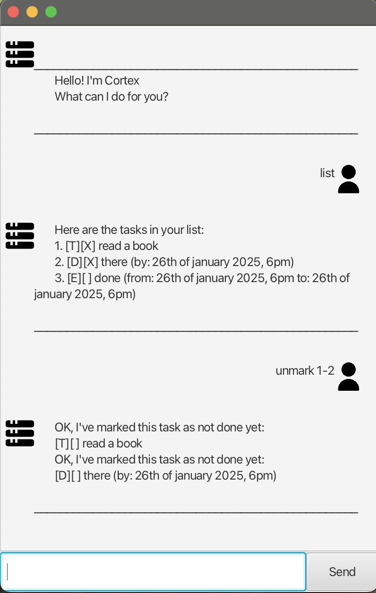

# Cortex User Guide




Cortex is a simple chatbot to keep track of your daily tasks.

## Adding to-dos

Format: `todo` TASK

You can use it to add simple to-dos to your list.

Example: `todo Read book`

The chatbot will add it to your list.
```
Got it. I've added this task:
[T][] Read book
Now you have 1 tasks in the list.
```


## Adding deadlines

Format: `deadline` TASK `/by` TIME

You can use it to add deadlines to your list.

Example: `deadline Lecture Quiz /by tomorrow`

The chatbot will add it to your list.

```
Got it. I've added this task:
[D][] Lecture Quiz (by: tomorrow)
Now you have 2 tasks in the list.
```
## Adding events

Format: `event` TASK `/from` TIME `/to` TIME

You can use it to add events with a specific time.

Example: `event Conference /from Monday /to Tuesday`

The chatbot will add it to your list.

```
Got it. I've added this task:
[E][] Conference (from: Monday to: Tuesday)
Now you have 3 tasks in the list.
```

## Viewing your task list

Format: `list`

The chatbot will show your numbered list.

```
Here are the tasks in your list:
1. [T][] Read book
2. [D][] Lecture Quiz (by: tomorrow)
3. [E][] Conference (from: Monday to: Tuesday)
```


## Deleting tasks

Format: `delete` TASK NUMBER

You can also use a range of task numbers to be deleted.

Example: `delete 3`
The chatbot will show a numbered list of your tasks.

```
Noted. I've removed this task:
[E][] Conference (from: Monday to: Tuesday)
Now you have 2 tasks in the list.
```

## Marking and Unmarking Tasks

Format: `mark` TASK NUMBER

Format: `unmark` TASK NUMBER

You can also use a range of task numbers to be marked or unmarked.

Example: `mark 1-2`

```
Nice! I've marked this task as done:
[T][X] Read book
Nice! I've marked this task as done:
[D][X] Lecture Quiz (by: tomorrow)
```